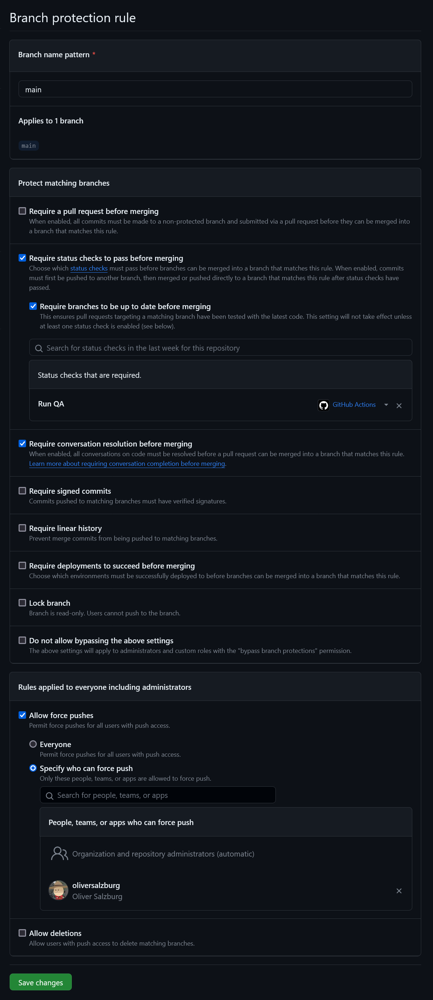

# Project Template

## Does

-   Provides scaffolding through [Middy](https://middy.js.org/) and [Powertools for AWS Lambda](https://docs.powertools.aws.dev/lambda/typescript/latest/)
-   [Yarn](https://yarnpkg.com/)
-   Uses [TypeScript](https://www.typescriptlang.org/)
-   Target application runs in [Node.js](https://nodejs.org/) as ESM inside the [NodeJS runtime of AWS Lambda](https://docs.aws.amazon.com/lambda/latest/dg/lambda-nodejs.html)
-   [esbuild](https://esbuild.github.io/)
-   [EditorConfig](https://editorconfig.org/) + [ESLint](https://eslint.org/) (with [@typescript-eslint](https://typescript-eslint.io/)) + [Prettier](https://prettier.io/) + [lint-staged](https://github.com/okonet/lint-staged)
-   QA with [GitHub Actions](https://github.com/features/actions)
-   [MkDocs](https://www.mkdocs.org/)-oriented Markdown in mind

## GitHub Repository Configuration

Recommended setting for the new repository:

